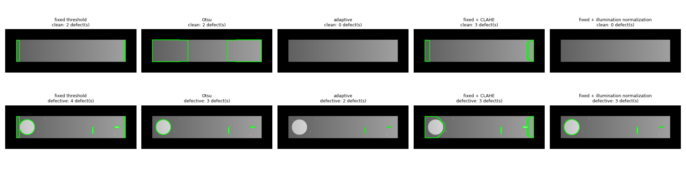
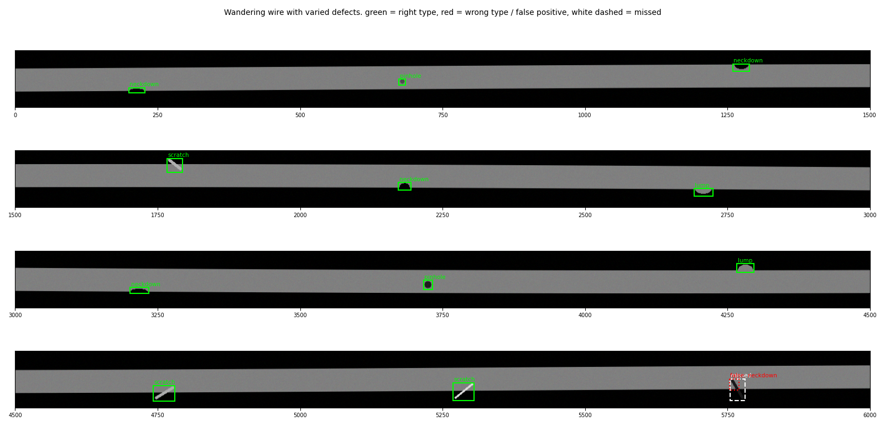

# Classical CV Defect Inspection

A small, dependency-light library for **golden-reference defect inspection** with classical computer vision (OpenCV + NumPy, no machine learning), plus a set of reproducible experiments that show where each technique helps and where it breaks.

It is modelled on industrial wire and cable inspection: compare each image against a known-good reference, find what differs, and say what kind of defect it is. It also simulates a **line-scan camera** watching a long wire go by.

Everything here is evaluated on **synthetic images generated by the repo itself**. Read [Limitations](#limitations) before drawing conclusions about real parts.



## How it works

`WireDefectInspector` takes a defect-free reference image once, then inspects test images against it:

```
test image
  -> median filter        (optional, denoise="median" / "median+gaussian")
  -> align to reference   (optional, align="template" / "ecc")
  -> grayscale
  -> illumination match   (optional, normalize_illumination=True)
  -> CLAHE                (optional, use_clahe=True)
  -> Gaussian blur        (unless denoise="median")
  -> |test - reference|
  -> threshold            (fixed / Otsu / adaptive)
  -> morphological open + close
  -> contours, filtered by area
  -> defects with shape features
```

The reference goes through the same preprocessing, so filter side effects cancel in the difference. With every option off, this is the plain "absdiff, threshold, clean up, find contours" pipeline.

## Setup

Requires **Python 3.10 or newer**.

```powershell
python -m venv cv-env
.\cv-env\Scripts\Activate.ps1          # Windows PowerShell
# source cv-env/bin/activate           # macOS / Linux

pip install -r requirements.txt        # just the library (OpenCV + NumPy)
pip install -r requirements-demo.txt   # library + matplotlib, to run the demos
```

Dependencies are pinned to the tested versions. The headless OpenCV build is used because nothing in the project opens an OpenCV window; do not install `opencv-python` alongside it.

## Quick start

```python
import cv2
from src.defect_detector import WireDefectInspector

reference = cv2.imread("golden.png")              # defect-free image, BGR
inspector = WireDefectInspector(reference)

result = inspector.inspect(cv2.imread("part.png"))   # same size as the reference
print(result["status"])                           # "Defective" or "Non-Defective"
for d in result["defects"]:
    print(d["x"], d["y"], d["w"], d["h"], d["area"])
cv2.imwrite("annotated.png", result["defect_img"])
```

Images must be 3-channel BGR (what `cv2.imread` returns by default) and the same size as the reference.

### Result

`inspect()` returns a dict:

| Key | Meaning |
|---|---|
| `status` | `"Defective"` if at least one defect was found, else `"Non-Defective"` |
| `defects` | list of dicts, one per defect (below) |
| `defect_img` | the analysed image with defect outlines drawn on it. When `denoise` or `align` is on, this is the denoised and aligned image, not your raw input |
| `aligned` | `None` if alignment is off, `True` if it succeeded, `False` if it failed to converge. A failed alignment leaves the image unaligned, so the part will normally come out `Defective` (it fails safe) |

Each defect has `x`, `y`, `w`, `h` (bounding box, in reference coordinates), `area`, and three shape features:

| Feature | Meaning |
|---|---|
| `circularity` | `4*pi*area/perimeter^2`; 1.0 is a perfect circle, thin lines are near 0.3 |
| `aspect_ratio` | long side / short side of the rotated bounding box, so a diagonal line still reads as long and thin |
| `polarity` | mean of (test - reference) over the defect; positive means brighter or extra material, negative means darker or missing material |

### Options

| Parameter | Default | What it does |
|---|---|---|
| `threshold` | `30` | Minimum grey-level difference to count as changed |
| `min_defect_size` | `20` | A contour's area must exceed this (px^2) to be reported |
| `blur_kernel` | `(5, 5)` | Gaussian blur size |
| `morph_kernel` | `(3, 3)` | Size of the open/close cleanup; features narrower than this are erased |
| `threshold_mode` | `"fixed"` | `"fixed"`, `"otsu"` or `"adaptive"` |
| `use_clahe` | `False` | Local contrast equalization |
| `normalize_illumination` | `False` | Rescale the test image to the reference's local brightness (handles uneven lighting) |
| `illum_ksize` | `101` | Window of the brightness estimate; keep it below the part size and around the size of your largest defect |
| `align` | `None` | `"template"` (whole-pixel translation, up to `align_search` px) or `"ecc"` (translation and rotation, subpixel) |
| `align_search` | `20` | Search range in px for template alignment |
| `lock_x` | `False` | Never translate along x. Use for stock that looks the same at every x (wire, tape): nothing pins x down, and the alignment would otherwise drift sideways |
| `denoise` | `"gaussian"` | `"gaussian"`, `"median"` or `"median+gaussian"`. Use a median filter for salt-and-pepper noise |
| `median_ksize` | `3` | Median filter size |
| `contour_color`, `contour_thickness` | green, 2 | Outline style in `defect_img` |

Defaults are tuned for clean, well-lit, registered images. Turn options on for the conditions you actually have.

An inspector instance keeps a little per-call state (`aligned`), so use one instance per thread.

## Line-scan wire simulation

[src/strip.py](src/strip.py) simulates a wire scanned by a line-scan camera: a long, thin image inspected in overlapping chunks against one clean stretch of wire as the reference.

- `make_strip()` generates a wire with random **pinholes, scratches, lumps and neckdowns**, optionally with random sizes, sensor or salt-and-pepper noise, a slow up-and-down **wander**, and scratches that cross a wire edge. It returns exact ground-truth boxes.
- `inspect_strip()` cuts the strip into chunks that overlap by 60 px and drops detections cut by a chunk edge, so nothing is double counted or split.
- `classify_defect()` names each defect from its shape and polarity: extra material at an edge is a lump, missing material is a neckdown, a shape reaching both sides of an edge is a scratch, and so on.
- `evaluate_strips()` scores the whole pipeline over many random strips.



## Demos

Each script prints its results and saves a figure next to it. All are deterministic (seeded), so a rerun reproduces the same numbers and images.

| Script | Shows | Runtime | Figure |
|---|---|---|---|
| `demo.py` | Basic inspection; **uneven lighting**; **shifted and rotated parts**; **salt-and-pepper noise** | ~6 s | `demo_output.png`, `demo_lighting.png`, `demo_alignment.png`, `demo_noise.png` |
| `demo_strip.py` | The wire simulation with fixed-size defects, noise sweep | ~30 s | `demo_strip.png` |
| `demo_strip_hard.py` | Varied defects, wire wander, edge-crossing scratches, settings trade-offs | ~90 s | `demo_strip_hard.png` |
| `01_absdiff.py`, `02_edge_detection.py` | The original learning experiments (difference, Canny) | seconds | window only |

```
python demo.py
```

On a machine without a display, set `MPLBACKEND=Agg` first; the figures are still saved.

## What the experiments showed

These are results on the synthetic images, not on real parts.

**Uneven lighting** (brightness ramps 0.7x to 1.3x across the part). Otsu, adaptive thresholding and CLAHE, the usual suggestions, did not fix it; rescaling the test image to the reference's local brightness did.

| Method | False positives on a clean part | Real defects found (of 3) |
|---|---|---|
| Fixed threshold | 2 | 3 |
| Otsu | 2 (it always splits the histogram, so it invents defects) | 3 |
| Adaptive | 0 | 2 (a large uniform defect looks like background) |
| CLAHE | 3 | 2 |
| **Illumination normalization** | **0** | **3** |

**Misalignment** (part shifted 4 px and rotated 2 degrees). Without alignment the shifted edges swamp the real defects.

| Alignment | Real defects found (of 3) | False positives |
|---|---|---|
| None | 1 | 3 |
| Template matching (translation only) | 2 | 5 |
| **ECC (translation and rotation)** | **3** | **0** |

**Salt-and-pepper noise.** The default blur-and-open pipeline already copes up to about 5% noise and breaks around 10% (about 6 false positives per clean image); a median filter (with `min_defect_size` lowered to 8, since the median shrinks small defects) brings that to 0. The order matters: alignment resamples the image and smears each speck into a blob the median can no longer remove, so the median runs **before** alignment. With 10% noise on a shifted and rotated part, ECC alignment alone gave 19 false positives per clean image; with the median first it gave 0.6.

**Wire strip**, 20 strips x 12 defects, sensor noise sigma=3:

| Scenario | Missed | False positives | Misclassified |
|---|---|---|---|
| A: fixed-size defects, straight wire | 0 | 0 | 0 |
| B: random sizes, brightness, angles | 16 | 0 | 0 |
| C: B with wire wander, no alignment | 157 | 49 | 0 |
| D: C with ECC alignment (`lock_x`) | 16 | 0 | 0 |
| E: D with scratches crossing an edge | 21 | 5 | 3 |

Things worth knowing that came out of this:

- Misses in B are the tiniest defects (1 px scratches, radius-3 pinholes): a detection floor set by the blur, threshold and morphological open, not a contrast problem.
- Catching smaller defects means letting speck noise through. Dropping the open step and shrinking the blur cut misses from 16 to 5, but false positives went from 0 to 95 at 1% specks and over 12,000 at 6%. A median filter removes the specks and the thin defects with them. The right setting depends on the smallest defect you must catch and the noise you expect.
- Without `lock_x`, ECC on a uniform wire drifted sideways and shifted reported positions by up to 15 px. With it, the error is at most 1 px.
- The remaining edge-scratch errors are mostly missing information: a dark scratch crossing a wire edge is dark grey on a black background, so half of it is invisible.

## Limitations

- **Synthetic data only.** Every threshold and setting was tuned on images generated by this repo. Noise is idealized, and there is no glare, lens distortion, texture or lighting drift on the wire. These results show that the methods behave sensibly, not that they work on your parts.
- **Registration.** Test and reference images must be the same size. Without `align`, the part must sit in the same place; ECC is iterative and needs to start within a few pixels and degrees (it converged up to a 30 px shift and 10 degrees here), and adds about 28 ms per 600x200 frame against about 0.5 ms without.
- **Detection floor.** Very small or thin defects can be missed: with default settings, 1 px lines and dots a few pixels across fall below what the blur, threshold and morphological open leave behind, and a median filter makes this worse by erasing 1 px features outright.
- **Classification is hand-written rules** tuned on the simulated defect types, and assumes horizontal wire edges. It is not a trained model.
- **No automated tests.** The deterministic demos serve as regression checks.
- Not implemented: camera calibration, encoder-triggered capture, OCR print verification, ML-based classification.

## Project layout

```
src/
  defect_detector.py   WireDefectInspector
  strip.py             line-scan wire simulation, chunked inspection, classification, evaluation
  utils.py             synthetic image generators, noise and misalignment, scoring helpers
demo.py                basic, lighting, alignment and noise demos
demo_strip.py          wire simulation demo
demo_strip_hard.py     harder wire simulation and trade-off study
01_absdiff.py          learning experiment: image difference
02_edge_detection.py   learning experiment: Canny edges
requirements.txt       library dependencies (pinned)
requirements-demo.txt  library + demo dependencies
```
